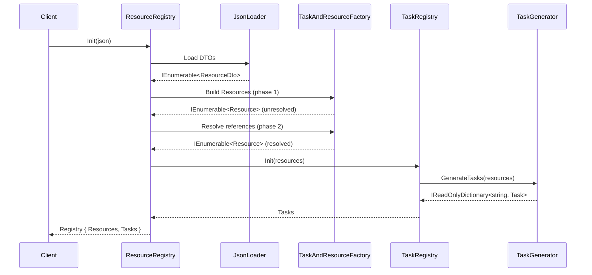
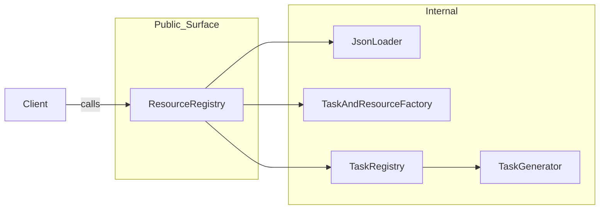
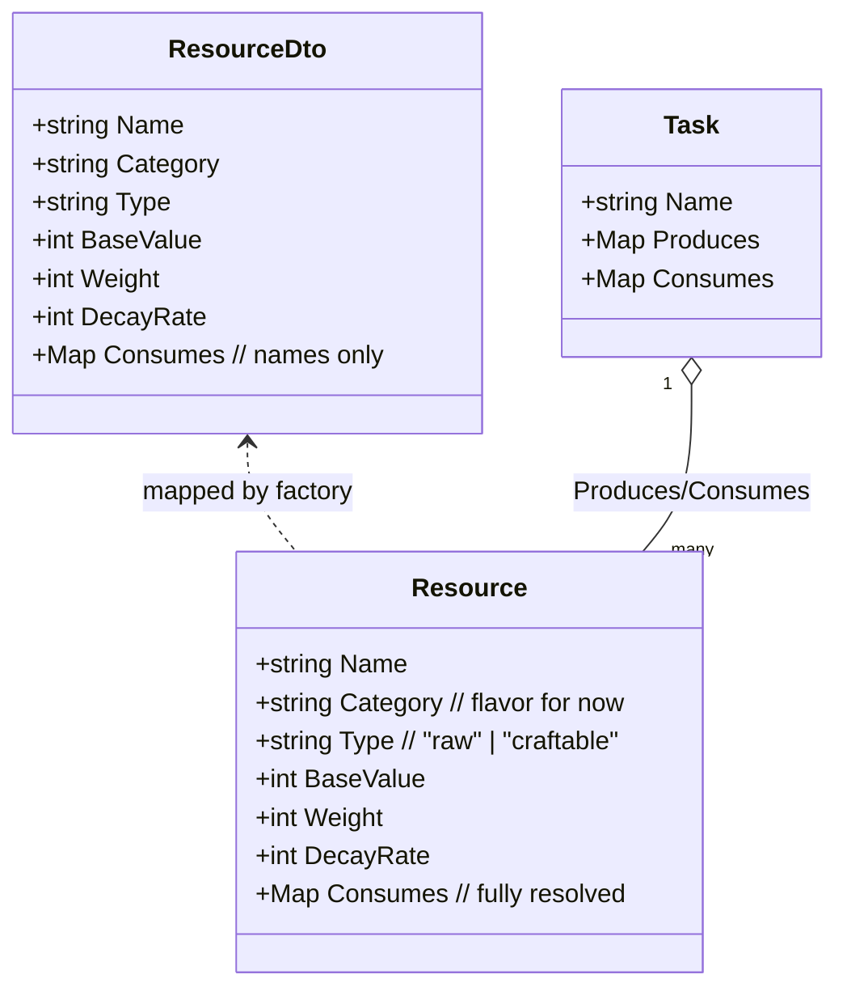
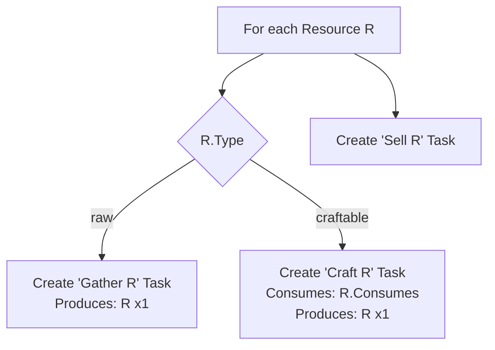

# Tasks & Resources Submodule
> A self-contained module that loads a **resource catalog** (JSON is the source of truth), resolves inter-resource references, and infers executable tasks (gather/craft/sell) from resource metadata.

---

## Scope & Boundaries

### Public API (stable)
- `ResourceRegistry.Init(jsonPath | stream | string)` → `Registry`
- `Registry.Resources : IReadOnlyDictionary<string, Resource>`
- `Registry.Tasks : IReadOnlyDictionary<string, Task>`

### Internal (do not cross the boundary)
- `JsonLoader`, `ResourceDto`, `TaskAndResourceFactory`, `TaskRegistry`, `TaskGenerator`

### Data Ownership
- JSON file is the only authoritative source. Domain objects are derived.

### Reference Resolution
- Two-phase build:
  1. Load DTOs  
  2. Construct domain `Resource` objects  
  3. Resolve `Consumes` to the actual `Resource` instances  

### No Side Effects
- Module is pure wrt input JSON ⇒ output registry. No I/O beyond loading JSON.

### Initialization Flow


### Module Dependency Graph

### Domain Model (essentials)

### Task Inference Rules


raw ⇒ Gather <R> (gatherable, not craftable)

craftable ⇒ Craft <R> (consumes its inputs)

all ⇒ Sell <R>

### Examples
- **Iron Ore** (raw) → *Gather Iron Ore*, *Sell Iron Ore*  
- **Iron Ingot** (craftable; consumes Iron Ore) → *Craft Iron Ingot*, *Sell Iron Ingot*  

---

## Invariants & Validation

### Acyclic Craft Graph
- `Consumes` must not introduce cycles (no infinite craft chains).  

### Closed World
- Every `Consumes` entry references a resource that exists in the same JSON.  

### Type Consistency
- `raw` must not have `Consumes` entries (enforce empty or ignore).  
- `craftable` may have one or more `Consumes` entries with integer amounts ≥ 1.  

### Identity
- `Name` must be unique (case-sensitive, or define a normalization rule).  

### Stability
- `Name` acts as the primary key for resolution; changing it is a breaking change.  

---

## JSON Source of Truth (excerpt)

```json
{
  "name": "Wood",
  "category": "Raw Materials",
  "type": "raw",
  "basevalue": 1,
  "weight": 1,
  "decayrate": 1,
  "consumes": {}
}
```
## Notes

- **Category** and **Name** are descriptive only (no mechanical meaning yet).  
- **Type** drives task inference (`raw` vs `craftable`).  

---

## Design Rationale (under the hood)

### DTO vs Domain
- DTOs mirror the JSON.  
- Domain objects are immutable, typed, and reference-resolved.  
- This separation prevents partially-constructed objects from leaking outside the module and makes invariants enforceable at the boundary.  

### Two-phase Resolution
1. Build a `Name → Resource` map.  
2. Rewrite `Consumes<string,int>` into `Consumes<Resource,int>`.  
3. This avoids order-dependence in the JSON and lets you detect cycles deterministically.  

### Deterministic Generation
- Task inference is a pure function of the resolved resource set.  
- Given the same JSON, the same `Resources` and `Tasks` are produced.  
- Ideal for CI checks.  

---

## Extension Points (future-safe)

- Enums for `Type` and `Category` to eliminate stringly-typed errors.  
- Task classes per verb (Gather/Craft/Sell) if behavior diverges (cost, time, locations).  
- Validation pass with explicit error reporting (missing inputs, cycles, negative counts).  
- Computed fields (e.g., `TotalMassCost` or craft time) once weights/values become mechanical.  
- Constraints (location/tool/skill requirements) carried on `Task` or `Resource`.  

---

## Usage (public entrypoint)

Usage (public entrypoint)
```csharp

Call ResourceRegistry.Init(...) with your JSON path/string/stream.

Receive a Registry containing:

Resources: fully resolved, immutable Resource instances.

Tasks: inferred Tasks keyed by name (Gather X, Craft Y, Sell Z).
```
